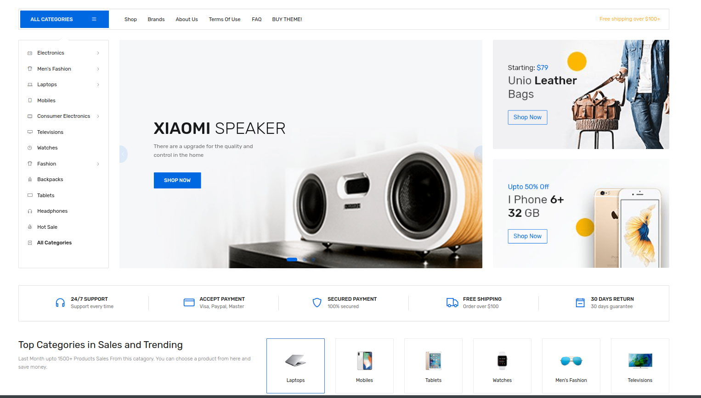

# Laravel E-Commerce (FleetCart)

E-commerce site develop by laravel use module based ex: Accounting,inventory, payment process, them, font-end, admin module, user management, order tracking, slider management




## Features

* Home page banner sections
* handsome & Powerful Admin Panel
* Multi vendor, multi channel and multi warehouse
* Multiple Currencies
* Third Party Integration for Updating Currency Rates
* Scheduled Currency Rate Updating
* Advanced Home Page Customization
* Advanced Search
* Algolia Search Engine Integration
* payment gateways
* Full RTL support (frontend and backend)
* Block/tier pricing out of the box
* Extension for customer/group based prices
* Discount and voucher support
* Flexible basket rule system
* Full-featured admin backend
* Product Options
* Product Attributes
* Advanced Product Filtering
* Guest Checkout
* Customer Panel
* Sales Analytics Chart
* Search Log
* Advanced System Report
* Custom Static Page
* Scheduled Special Product Price
* Country, State, City, Zip Based Tax Configuration
* Minimum Amount for Free Shipping
* File Manager
* Drag & Drop File Uploader
* Custom CSS/JS
* Custom 404 Page
* SEO Optimized
* Maintenance Mode
* Extremely configurable and extensible
* Extension for market places with millions of vendors
* Fully SEO optimized including rich snippets
* Translated to 30+ languages
* AI-based text translation
* Optimized for smart phones and tablets

## Installation

### Server Requirements

Before you install FleetCart make sure your server meets the following requirements:
```
- PHP 7.3+
- MySQL 5.6+ or MariaDB 10.0+
- OpenSSL PHP Extension
- PDO PHP Extension
- Mbstring PHP Extension
- Tokenizer PHP Extension
- XML PHP Extension
- Ctype PHP Extension
- JSON PHP Extension 
```

### Installing

#### - Step 1: Extract and Upload
Unzip the downloaded archive package. Rename the directory to your desired directory name and upload the directory to your web server through FTP or Control Panel.

#### - Step 2: Creating Database
Create a database for through your server control panel. If your server has phpMyAdmin, then you can also create a database using phpMyAdmin.

#### - Step 3: Run Installation Wizard
Go to your website address, then you'll see an installation wizard.

#### - WARNING
```
You should configure your web server's document / web root to be the public directory.

``` 
#### - Pre Installation

Pre Installation page checks if your server meets the requirements and has the correct directory permissions to setup.

Directories within the storage and the bootstrap/cache directories should be writable by your web server.

#### - Configuration
You need to fill the database connection details, administration details, and store details, then click the Install button to install.

#### - Complete
You'll see a success message after successfully installing. You now have the option to browse your online store or log into the administration panel.


#### - Admin Panel
Admin panel is the place where you can manage products, categories, coupons, orders, pages, and much more. You can also customize the look of your store from the admin panel.


#### Login
To access the admin panel add /admin after your website address. For example if your website address is "www.examplestore.com", then your admin panel is located at "www.examplestore.com/admin".


